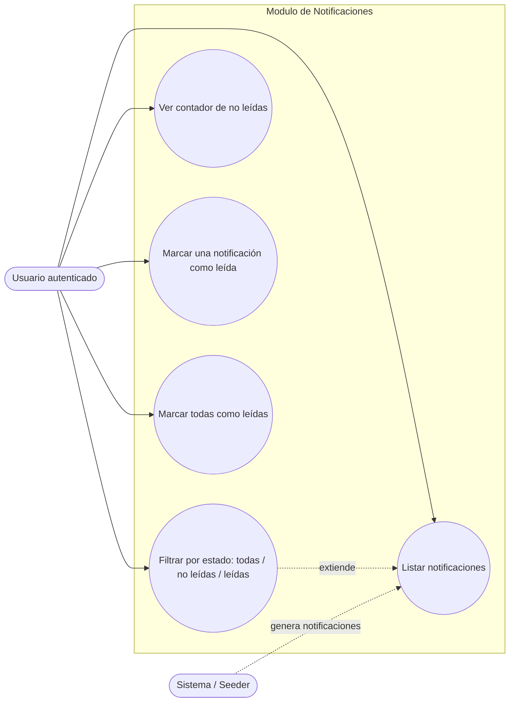
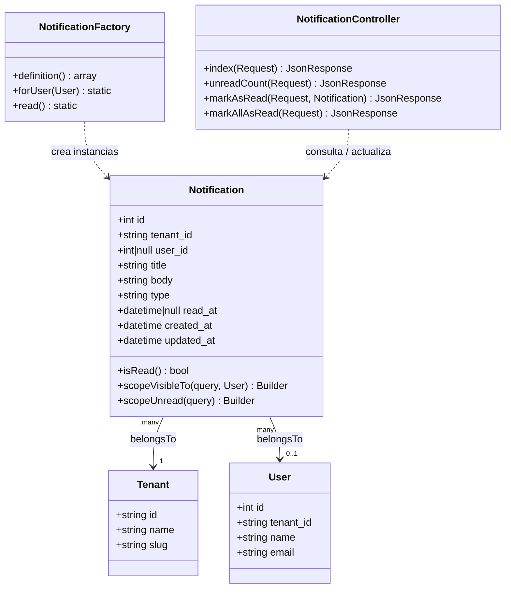
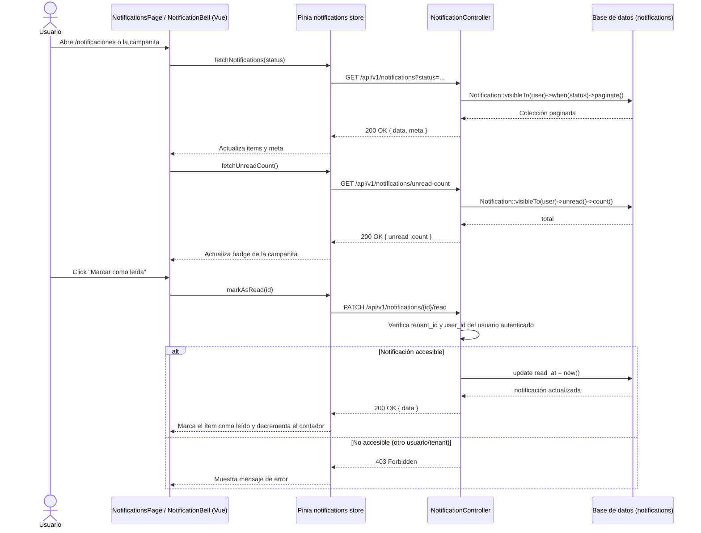

# Módulo 25 — Notificaciones internas: Diagramas UML

Este documento contiene los diagramas UML (Base Global) del módulo
**Notificaciones internas**, correspondientes al Sprint 3. Los diagramas
están escritos en formato [Mermaid](https://mermaid.js.org/) y se renderizan
automáticamente al visualizar este archivo en GitHub.

## 1. Diagrama de casos de uso

Actores: **Usuario autenticado** (cualquier rol con sesión activa) y el
**Sistema** (origen de las notificaciones de difusión y personales).

**Descripción de los casos de uso**

| Caso de uso | Descripción | Endpoint asociado |
|---|---|---|
| Listar notificaciones | El usuario consulta las notificaciones visibles para él (personales + difusión de su tenant), paginadas. | `GET /api/v1/notifications` |
| Filtrar por estado | Extiende el listado permitiendo filtrar por `all`, `unread` o `read`. | `GET /api/v1/notifications?status=...` |
| Ver contador de no leídas | El usuario obtiene cuántas notificaciones no leídas tiene, usado por la campanita del header. | `GET /api/v1/notifications/unread-count` |
| Marcar una notificación como leída | El usuario marca una notificación individual como leída, validando que le pertenezca o sea de difusión de su tenant. | `PATCH /api/v1/notifications/{notification}/read` |
| Marcar todas como leídas | El usuario marca como leídas todas las notificaciones visibles que aún estén pendientes. | `PATCH /api/v1/notifications/read-all` |

## 2. Diagrama de clases

Representa las clases involucradas en el módulo: el modelo `Notification`,
sus relaciones con `Tenant` y `User`, su fábrica de pruebas y el controlador
de la API.

**Notas sobre el modelo**

- `user_id` nulo indica una **notificación de difusión** (visible para todo
  el tenant). Si tiene valor, es una **notificación personal**.
- `scopeVisibleTo` centraliza la regla de visibilidad: mismo `tenant_id` y
  (`user_id` nulo O `user_id` igual al del usuario autenticado).
- `scopeUnread` filtra por `read_at IS NULL`.
- `type` admite los valores `info`, `success`, `warning`, `danger`, usados
  para dar estilo visual en la interfaz.

## 3. Diagrama de secuencia

Flujo principal: el usuario abre la página de notificaciones, el frontend
consulta el listado y el contador de no leídas, y luego marca una
notificación como leída.

## 4. Relación con el resto del sistema (Base Global)

- El módulo se apoya en la **autenticación JWT** (`guard api`,
  middleware `jwt.auth`) y en el **middleware de tenant** (`tenant`,
  cabecera `X-Tenant-ID`), ambos ya existentes en la base del proyecto.
- La tabla `notifications` referencia `tenants.id` y `users.id` mediante
  llaves foráneas con `cascadeOnDelete`, integrándose al esquema
  multi-tenant general.
- El `NotificationSeeder` se agregó al `DatabaseSeeder` general, junto a
  `RoleSeeder` y `TenantSeeder`, para poblar datos de demostración.
